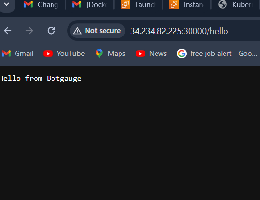

# Simple GoLang Application

This is a simple GoLang application accessible at the `/hello` path. The application is containerized using Docker, deployed to an EKS cluster using Terraform and Helm, and the entire workflow is automated using GitHub Actions.

## Automated with GitHub Actions
This project uses GitHub Actions for CI/CD automation. The workflow is defined in .github/workflows/main.yml. It includes steps for:

Building the Docker image
Pushing the Docker image to a container registry
Applying Terraform scripts
Deploying the application to EKS using Helm

## Features

- GoLang application accessible at `/hello`.
- Dockerfile for containerizing the application.
- Terraform scripts for setting up AWS EKS with necessary add-ons:
  - IAM roles
  - VPC setup
  - Security groups
  - Node groups
- Helm charts for deploying the application to Kubernetes.
- GitHub Actions for CI/CD automation.

## Prerequisites

- [Go](https://golang.org/doc/install) 
- [Docker](https://get.docker.com/) 
- [Terraform](https://learn.hashicorp.com/tutorials/terraform/install-cli) 
- [kubectl](https://kubernetes.io/docs/tasks/tools/install-kubectl/) 
- [Helm](https://helm.sh/docs/intro/install/) 
- AWS account and CLI configuration
- GitHub account
- Dockerhub username and token

1. **Manual Steps**:
   ```bash
   git clone https://github.com/Prabhu028/golang_assessment
   cd golang_assessment/go-app
   docker image build -t <username><repo-name>:<tag> .
   docker push <username><repo-name>:<tag>
   docker container run -d --name <container-name> -P <username><repo-name>:<tag> 
   cd terraform
   terraform init
   terraform apply
   cd app-helm 
   helm create app-helm
   helm package app-helm
   helm install app-helm ./app-helm-0.1.0.tgz




